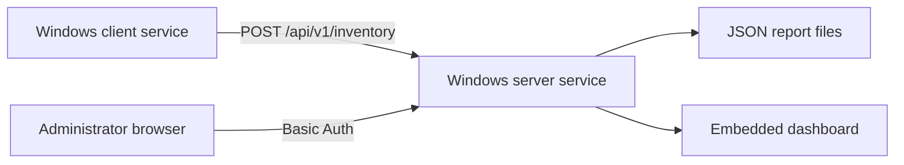

# Windows Soft Inventory

## Description

Windows Soft Inventory is a standalone inventory system for Windows workstations and servers. It collects OS details, installed software, Microsoft Office version, Office activation status, Windows activation status, hardware model data, and the installed client version.

The project uses a small C# client service and a small C# server service. The client pushes inventory reports to the server over HTTP. The server stores each report as a JSON file and serves a built-in web dashboard. The default deployment does not require IIS, SQL Server, Python, Node.js, NuGet packages, or a separate web application runtime.

## Main Features

- Client runs as a Windows Service on Windows 7, 8, 10, and 11.
- Server runs as a Windows Service on Windows Server or desktop Windows.
- Inventory data includes OS version, build, architecture, hardware vendor, model, serial number, Office version, activation facts, and installed software.
- The dashboard has a client view, a per-client software drill-down, and a software view that shows where each package is installed.
- The dashboard displays server version and client agent version.
- Operators can delete stale or unwanted host records from the dashboard.
- GPO deployment scripts support initial install and later client updates.
- GPO packages include separate .NET 3.5 and .NET 4 client builds to avoid .NET 3.5 prompts on newer Windows versions.
- Optional Basic Auth protects the dashboard and web API.
- Optional ingestion token restricts client report submission.

## Architecture



The client collects data through WMI and registry reads. It writes a local JSON report under `ProgramData` and sends the same JSON to the server. The server stores one JSON file per computer name. The dashboard builds its client and software views from those server-side report files.

## Requirements

Client:

- Windows 7, 8, 10, or 11
- .NET Framework 3.5 or newer
- Built-in Windows PowerShell for installer scripts
- Network access to the server HTTP port

Server:

- Windows Server or desktop Windows
- .NET Framework 3.5 or newer
- Built-in Windows PowerShell for installer scripts
- One TCP port for the standalone HTTP listener

Build host:

- Windows with the local .NET Framework C# compiler
- Windows PowerShell 5.1 or PowerShell 7 for build and install scripts

## Build

Build the server:

```powershell
.\src\Build-Server.ps1
```

Build the default client:

```powershell
.\src\Build-Client.ps1
```

Build a GPO package with both client target frameworks:

```powershell
.\src\New-ClientGpoPackage.ps1 `
    -ServerUrl 'http://inventory.example.local:8080/api/v1/inventory' `
    -OutputPath '.\dist\gpo-client'
```

If the `.cmd` startup wrapper lives in SYSVOL and the PowerShell script plus client executables live in another share, pass the package share path:

```powershell
.\src\New-ClientGpoPackage.ps1 `
    -ServerUrl 'http://inventory.example.local:8080/api/v1/inventory' `
    -OutputPath '.\dist\gpo-client' `
    -PackageSharePath '\\fileserver.example.local\software\windows-soft-inventory'
```

## Server Installation

Install the server from an elevated PowerShell session:

```powershell
.\src\Install-Server.ps1 -ListenPrefix 'http://+:8080/' -OpenFirewall
```

Install the server with Basic Auth:

```powershell
.\src\Install-Server.ps1 `
    -ListenPrefix 'http://+:8080/' `
    -OpenFirewall `
    -WebUsername 'inventory-admin' `
    -WebPassword 'replace-with-a-strong-password'
```

The installer writes `C:\ProgramData\WindowsLicenseInventory\server-config.json`. Later updates reuse saved `ListenPrefix`, paths, `Token`, `WebUsername`, and `WebPassword` when you do not pass new values.

Dashboard URL:

```text
http://inventory.example.local:8080/
```

## Client Installation

Install one client from an elevated PowerShell session:

```powershell
.\src\Install-Client.ps1 `
    -ServerUrl 'http://inventory.example.local:8080/api/v1/inventory' `
    -IntervalHours 6
```

Run one local collection without installing the service:

```powershell
.\src\Collect-WindowsLicenseInventory.ps1 -OutputPath '.\output\localhost.json'
```

Run one collection through the compiled client:

```powershell
.\build\WindowsLicenseInventoryClient.exe `
    --once `
    --server-url 'http://inventory.example.local:8080/api/v1/inventory'
```

## GPO Deployment

Use a computer startup script, not a user logon script. The deploy script creates or updates a Windows Service and needs local administrator rights. Computer startup scripts run in the machine context and can manage services.

Deployment flow:

1. Build the package with `New-ClientGpoPackage.ps1`.
2. Copy the package to a computer-readable share.
3. Grant target computer accounts read access to the package files.
4. Grant target computer accounts write access to the package `Logs` folder if you want central installation logs.
5. Add `Install-ClientGpo.cmd` as a GPO computer startup script.
6. Reboot target computers or wait for the next startup script run.

The deploy script writes:

- Local log: `C:\ProgramData\WindowsLicenseInventory\Logs\gpo-deploy.log`
- Central log: `Logs\<COMPUTERNAME>.log` inside the package folder

For updates, replace the package files in the share. The deploy script compares the packaged client version with the installed version and skips clients that already match.

## Dashboard Usage

The dashboard has two views:

- `Clients`: one row per computer, with OS, Office, activation status, software count, report time, and client agent version.
- `Software`: one row per software name, version, and publisher, with the computers where the package appears.

Click a computer name to see its installed software list. Click a software name to see installation targets.

Deleting a host from the dashboard removes the server-side JSON report for that host. It also removes that host from the software view. If the client service still runs and can reach the server, the host appears again after the next sync.

`Stale >48h` counts reports older than 48 hours or reports with invalid report timestamps.

## Configuration

- `ServerUrl`: HTTP endpoint that receives client JSON files.
- `IntervalHours`: client collection interval from 1 to 24 hours.
- `ListenPrefix`: server HTTP listener prefix, for example `http://+:8080/`.
- `DataPath`: server folder for received JSON files.
- `ContentPath`: server folder for dashboard HTML, CSS, and JavaScript.
- `ConfigPath`: server configuration file. Default: `C:\ProgramData\WindowsLicenseInventory\server-config.json`.
- `Token`: optional shared token sent in `X-Inventory-Token`.
- `WebUsername` and `WebPassword`: optional Basic Auth credentials for dashboard and web API access.

## Security Notes

- The collector stores activation facts only. It does not export product keys.
- Basic Auth protects browser access, but plain HTTP does not encrypt credentials. Use HTTPS termination or restrict access to trusted management networks.
- Use `-Token`, firewall rules, and network ACLs to limit who can submit inventory reports.
- Do not place a sensitive token in a broadly readable SYSVOL script. For GPO deployments, prefer firewall scope or a low-sensitivity ingestion token.
- Limit write access to the GPO package `Logs` folder to the required computer accounts.
- Review [docs/threat-model.md](./docs/threat-model.md) before exposing the server outside a management network.

## Uninstall

Remove the client service and local client files:

```powershell
.\src\Uninstall-Client.ps1
```

## Project Layout

- `src/`: collector, build scripts, install scripts, and service source code.
- `src/client/`: standalone C# Windows Service client.
- `src/server/`: standalone C# Windows Service server and embedded dashboard.
- `deploy/client/`: GPO startup deployment script and command wrapper.
- `server/dashboard/`: static dashboard files copied by the server installer.
- `docs/`: threat model and operational security notes.
- `examples/`: example install and one-shot commands.
- `tests/`: syntax and language checks.

## License

[MIT License](./LICENSE). Copyright (c) 2026 didimozg.
