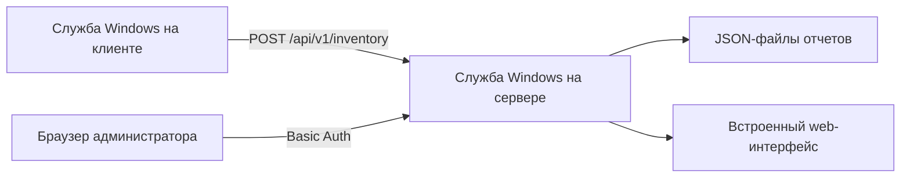
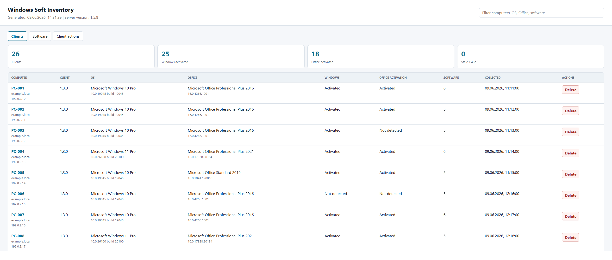
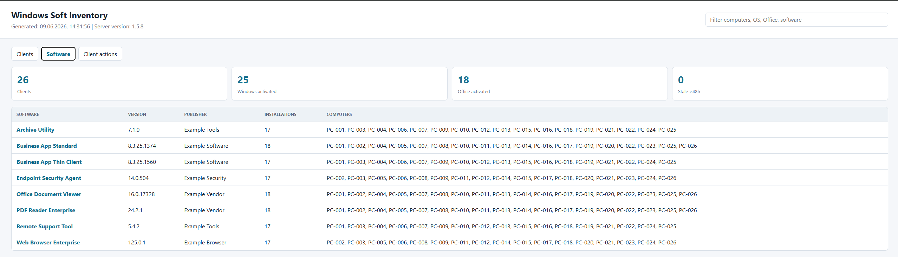
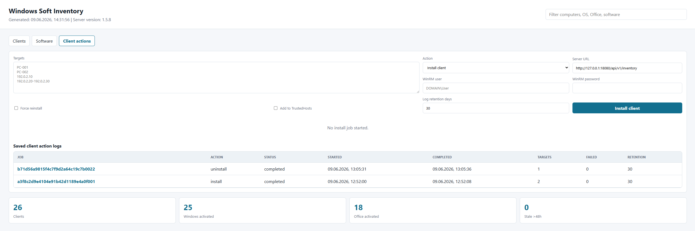

# Windows Soft Inventory

[](https://github.com/didimozg/windows-license-inventory-dashboard/releases)
[](https://github.com/didimozg/windows-license-inventory-dashboard/actions/workflows/ci.yml)
[](./LICENSE)

## Описание

Windows Soft Inventory - самостоятельная система инвентаризации Windows-компьютеров и серверов. Клиент собирает сведения об операционной системе, установленном ПО, версии Microsoft Office, факте активации Office и Windows, модели устройства, серийном номере и версии установленного агента.

Проект состоит из небольшого клиента на C# и сервера на C#. Клиент работает как служба Windows и отправляет отчеты на сервер по HTTP. Сервер тоже работает как служба Windows, хранит отчеты в JSON-файлах и показывает встроенный web-интерфейс. Для основного сценария не нужны IIS, SQL Server, Python, Node.js, NuGet-пакеты или отдельная среда выполнения для web-приложения.

## Возможности

- Клиент работает как служба Windows на Windows 10 и 11.
- Сервер работает как служба Windows на Windows Server или настольной Windows.
- Отчет содержит версию ОС, номер сборки, архитектуру, производителя, модель, серийный номер, IP-адреса, версию Office, факты активации и список установленного ПО.
- Web-интерфейс показывает список клиентов, детализацию ПО по каждому хосту и вкладку ПО со списком компьютеров для каждого пакета.
- Web-интерфейс показывает версию сервера и версию клиентского агента.
- Хосты можно удалять из web-интерфейса, если запись больше не нужна.
- Из web-интерфейса можно устанавливать, обновлять и удалять клиенты через WinRM.
- Скрипты развертывания через GPO поддерживают первичную установку и обновление клиента.
- GPO-пакет содержит отдельные сборки клиента под .NET 3.5 и .NET 4, чтобы Windows 10/11 не запрашивали установку .NET 3.5.
- Basic Auth может защищать web-интерфейс и web API.
- Токен приема отчетов может ограничивать отправку клиентских отчетов.

## Архитектура



Клиент собирает данные через WMI и чтение реестра. Он пишет локальный JSON в `ProgramData` и отправляет тот же JSON на сервер. Сервер хранит по одному JSON-файлу на компьютер. Web-интерфейс строит вкладки клиентов и ПО по этим серверным JSON-файлам.

## Требования

Клиент:

- Windows 10 или 11
- .NET Framework 3.5 или новее
- Встроенный Windows PowerShell для скриптов установки
- Сетевой доступ к HTTP-порту сервера

Сервер:

- Windows Server или настольная Windows
- .NET Framework 3.5 или новее
- Встроенный Windows PowerShell для скриптов установки
- Один TCP-порт для встроенного HTTP-сервера

Хост для сборки:

- Windows с локальным компилятором C# из .NET Framework
- Windows PowerShell 5.1 или PowerShell 7 для сборки и установки

## Сборка

Сборка сервера:

```powershell
.\src\Build-Server.ps1
```

Сборка клиента по умолчанию:

```powershell
.\src\Build-Client.ps1
```

Сборка GPO-пакета с двумя целевыми версиями .NET Framework для клиента:

```powershell
.\src\New-ClientGpoPackage.ps1 `
    -ServerUrl 'http://inventory.example.local:8080/api/v1/inventory' `
    -OutputPath '.\dist\gpo-client'
```

Если `.cmd`-обертка лежит в SYSVOL, а PowerShell-скрипт и клиентские `.exe` лежат в другой сетевой папке, укажите путь к этой папке:

```powershell
.\src\New-ClientGpoPackage.ps1 `
    -ServerUrl 'http://inventory.example.local:8080/api/v1/inventory' `
    -OutputPath '.\dist\gpo-client' `
    -PackageSharePath '\\fileserver.example.local\software\windows-soft-inventory'
```

## Установка сервера

Запустите установку сервера из PowerShell с правами администратора:

```powershell
.\src\Install-Server.ps1 -ListenPrefix 'http://+:8080/' -OpenFirewall
```

Установка сервера с Basic Auth:

```powershell
.\src\Install-Server.ps1 `
    -ListenPrefix 'http://+:8080/' `
    -OpenFirewall `
    -WebUsername 'inventory-admin' `
    -WebPassword 'replace-with-a-strong-password'
```

Установщик пишет настройки в `C:\ProgramData\WindowsLicenseInventory\server-config.json`. При следующих обновлениях он переиспользует сохраненные `ListenPrefix`, пути, `Token`, `WebUsername` и `WebPassword`, если вы не передали новые значения.

Адрес web-интерфейса:

```text
http://inventory.example.local:8080/
```

## Установка клиента

Установка одного клиента из PowerShell с правами администратора:

```powershell
.\src\Install-Client.ps1 `
    -ServerUrl 'http://inventory.example.local:8080/api/v1/inventory' `
    -IntervalHours 6
```

Разовый локальный сбор без установки службы:

```powershell
.\src\Collect-WindowsLicenseInventory.ps1 -OutputPath '.\output\localhost.json'
```

Разовый сбор через собранный клиент:

```powershell
.\build\WindowsLicenseInventoryClient.exe `
    --once `
    --server-url 'http://inventory.example.local:8080/api/v1/inventory'
```

## Развертывание через GPO

Используйте сценарий запуска компьютера, а не сценарий входа пользователя. Скрипт развертывания создает или обновляет службу Windows и требует прав локального администратора. Сценарии запуска компьютера выполняются от имени компьютера и могут управлять службами.

Порядок развертывания:

1. Соберите пакет через `New-ClientGpoPackage.ps1`.
2. Скопируйте пакет в сетевую папку, доступную учетным записям компьютеров.
3. Выдайте целевым компьютерам право чтения файлов пакета.
4. Выдайте целевым компьютерам право чтения сетевой папки пакета.
5. Добавьте `Install-ClientGpo.cmd` как GPO-сценарий запуска компьютера.
6. Перезагрузите целевые компьютеры или дождитесь следующего запуска сценария.

Скрипт развертывания пишет локальный лог в `C:\ProgramData\WindowsLicenseInventory\Logs\gpo-deploy.log`.
Запись центрального лога в сетевую папку пакета оставлена в скрипте как закомментированный код и по умолчанию отключена.

Для обновления замените файлы пакета в сетевой папке. Скрипт развертывания сравнит версию клиента в пакете с установленной версией и пропустит компьютеры, где версия уже совпадает.

## Принудительные действия с клиентом через WinRM

Вкладка `Client actions` в web-интерфейсе может установить, обновить или удалить клиент на одном хосте, списке хостов, одном IP-адресе или простом IPv4-диапазоне, например `192.0.2.10-192.0.2.20`.

Требования:

- WinRM включен на целевых компьютерах.
- Учетная запись серверной службы имеет права администратора на целевых компьютерах.
- Учетной записи серверной службы разрешено подключение по WinRM.
- На сервере есть локальный клиентский пакет с `Deploy-ClientGpo.ps1`, `WindowsLicenseInventoryClient-net35.exe` и `WindowsLicenseInventoryClient-net40.exe`.

Если цели указаны IP-адресами, Windows не сможет использовать обычную Kerberos-аутентификацию. Используйте один из вариантов:

- Указывать DNS-имена компьютеров вместо IP-адресов.
- Использовать WinRM по HTTPS.
- Указать явные учетные данные WinRM в web-интерфейсе и включить `Add to TrustedHosts`.

Соберите клиентский пакет перед установкой или обновлением сервера:

```powershell
.\src\New-ClientGpoPackage.ps1 `
    -ServerUrl 'http://inventory.example.local:8080/api/v1/inventory' `
    -OutputPath '.\dist\gpo-client'
```

`Install-Server.ps1` копирует `.\dist\gpo-client` в `C:\ProgramData\WindowsLicenseInventory\client-package`, если такая папка существует. Также можно передать `-ClientPackageSourcePath` и `-ClientPackagePath`.

Если серверная служба работает от имени LocalSystem, установка по WinRM на удаленные компьютеры обычно не сработает. Запускайте службу от доменной учетной записи с нужными правами локального администратора или используйте управляемую сервисную учетную запись с такими же правами.
Не передавайте пароль WinRM через web-интерфейс по обычному HTTP за пределами доверенной сети администрирования.

Сервер хранит логи заданий WinRM в `DataPath\_client-install-jobs`. Срок хранения по умолчанию составляет 30 дней. Другой срок можно задать при установке сервера:

```powershell
.\src\Install-Server.ps1 `
    -ListenPrefix 'http://+:8080/' `
    -InstallLogRetentionDays 60
```

Вкладка `Client actions` также позволяет задать срок хранения для отдельного задания. В сохраненный лог попадают действие, цели, статус, вывод команды, ошибки, временные метки и имя пользователя WinRM. Пароли в файлы логов не записываются.

## Работа с web-интерфейсом

Web-интерфейс содержит три вкладки:

- `Clients`: одна строка на компьютер, с ОС, Office, состоянием активации, количеством установленного ПО, временем отчета и версией клиентского агента.
- `Software`: одна строка на имя ПО, версию и издателя, со списком компьютеров, где найден пакет.
- `Client actions`: действия WinRM для установки, обновления или удаления клиента.

Нажмите имя компьютера, чтобы увидеть список установленного ПО. Нажмите имя ПО, чтобы увидеть список компьютеров с этим пакетом.

Удаление хоста из web-интерфейса удаляет серверный JSON-отчет этого хоста. Хост также пропадает из вкладки ПО. Если клиентская служба продолжает работать и видит сервер, хост появится снова после следующей синхронизации.

`Stale >48h` показывает отчеты старше 48 часов или отчеты с некорректной меткой времени.

## Скриншоты

На скриншотах используются примерные имена хостов, документационные IP-адреса и тестовый домен.







## Конфигурация

- `ServerUrl`: HTTP-адрес для приема клиентских JSON-файлов.
- `IntervalHours`: интервал сбора на клиенте от 1 до 24 часов.
- `ListenPrefix`: префикс HTTP-слушателя сервера, например `http://+:8080/`.
- `DataPath`: серверная папка для полученных JSON-файлов.
- `ContentPath`: серверная папка для HTML, CSS и JavaScript web-интерфейса.
- `ConfigPath`: файл конфигурации сервера. По умолчанию `C:\ProgramData\WindowsLicenseInventory\server-config.json`.
- `InstallLogRetentionDays`: срок хранения логов клиентских действий через WinRM. По умолчанию `30`.
- `Token`: общий токен, который клиент отправляет в заголовке `X-Inventory-Token`.
- `WebUsername` и `WebPassword`: учетные данные Basic Auth для web-интерфейса и web API.

## Безопасность

- Сборщик сохраняет только факт активации. Ключи продуктов не экспортируются.
- Basic Auth защищает доступ через браузер, но обычный HTTP не шифрует учетные данные. Используйте завершение HTTPS или ограничьте доступ доверенными сетями администрирования.
- Ограничьте отправителей inventory-отчетов через `-Token`, правила Firewall и сетевые ACL.
- Не кладите чувствительный токен в SYSVOL-скрипт с широким доступом на чтение. Для развертывания через GPO лучше использовать ограничение по Firewall или токен приема отчетов с низкой ценностью.
- Если включаете закомментированную запись центрального GPO-лога, ограничьте право записи в эту папку только нужными учетными записями компьютеров.
- Перед публикацией сервера за пределы сети администрирования прочитайте [docs/threat-model.md](./docs/threat-model.md).

## Удаление

Удаление клиентской службы и локальных файлов клиента:

```powershell
.\src\Uninstall-Client.ps1
```

## Структура проекта

- `src/`: сборщик, скрипты сборки, скрипты установки и исходный код служб.
- `src/client/`: самостоятельный C# клиент как служба Windows.
- `src/server/`: самостоятельный C# сервер как служба Windows и встроенный web-интерфейс.
- `deploy/client/`: скрипт развертывания через GPO и командная обертка.
- `server/dashboard/`: статические файлы web-интерфейса, которые копирует установщик сервера.
- `docs/`: threat model и заметки по эксплуатационной безопасности.
- `examples/`: примеры установки и разового запуска.
- `tests/`: проверки синтаксиса и языка.

## Лицензия

[MIT License](./LICENSE). Copyright (c) 2026 didimozg.
